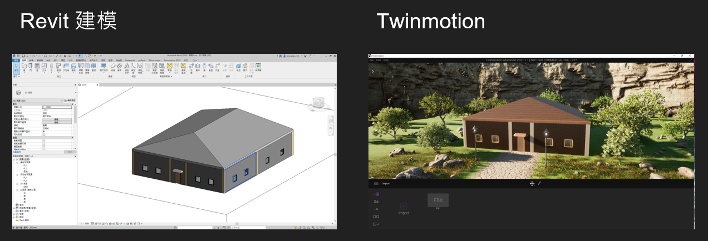
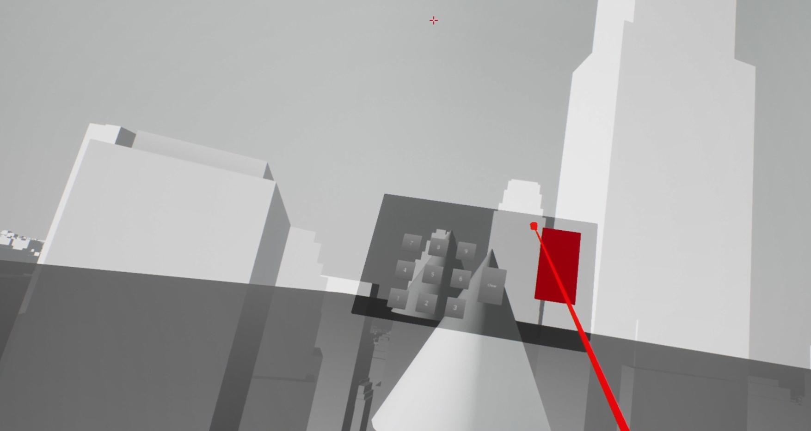

# Mechanical-Designer-s-Trick-House

## UE4 project and demo video:
The URLs of the UE4 project and the demo video are in `url.txt`

## Revit model and Twinmotion:

## Scenes in the game:
  
  
  
  

## UE4 with Arduino:
The buzzer will make noise when some events happen.
  

## More detail:
https://drive.google.com/file/d/1OnJui95J7gpM9iO6RXl7bEJkgWVbs1P3/view?usp=sharing
